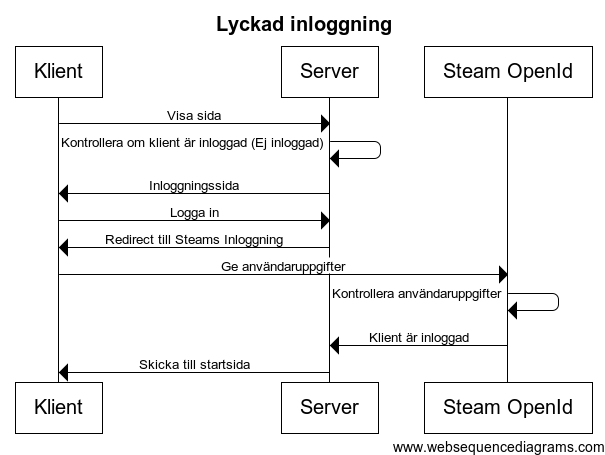
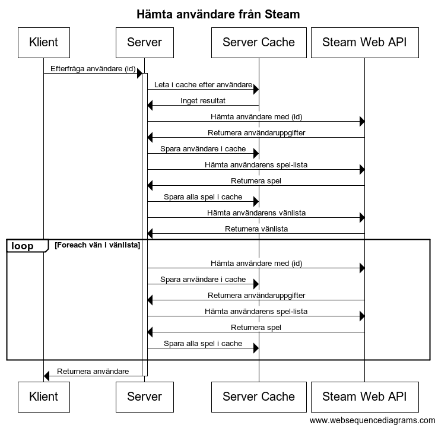
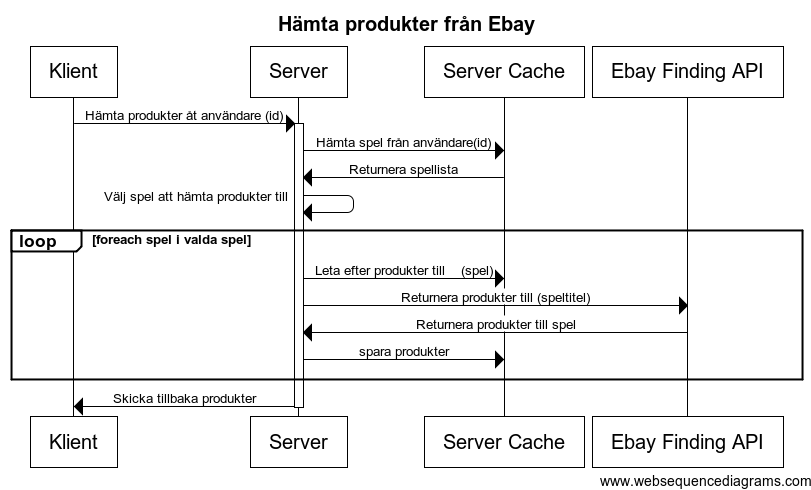
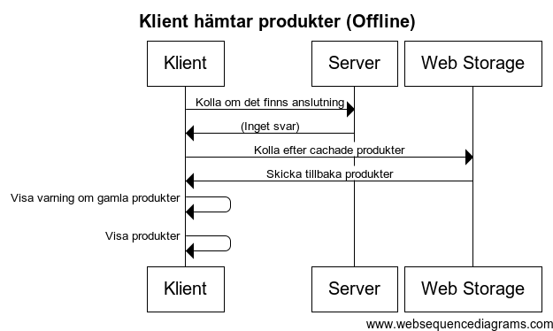

#Slutrapport - SteamStuff
**Namn:** Henrik Gabrielsson (hg222aa)  
**Kurs:** Webbteknik II (1DV449)  
**Datum:** 2015-01-12  
**Publik URL:**  [SteamStuff](http://henrikgabrielsson.se/SteamStuff/)

##Inledning
Applikationen som jag har skapat heter SteamStuff. Det är en mashup-applikation som låter en användare logga in med sitt Steam-konto (Steam är en applikation där man enkelt kan hantera sina spel, köpa nya, och spela mot andra spelare.) och sedan få förslag på kringprodukter (merchandise) från Ebay. Förslagen baseras på vilka spel man äger och på hur mycket man spelat dem. Man kan också få förslag på produkter till sina Steam-vänner, om man vill köpa en present till någon av dem.
API:erna som jag använt för att skapa applikationen är [Steam Web API](https://developer.valvesoftware.com/wiki/Steam_Web_API) och [Ebay Finding API](http://developer.ebay.com/DevZone/finding/Concepts/FindingAPIGuide.html). För att man ska kunna logga in med sitt  Steam-konto så används Steams egna OpenId-tjänst.  
Jag har letat runt en del och medan det finns många sidor som säljer gaming merchandise, så hittar jag inga som försöker skräddarsy förslag baserat på vilka spel man spelar, så därför tänkte jag att det kunde bli intressant att försöka skapa en sådan sajt.

##Dataflödesschema

###Lyckad inloggning

###Hämta användare från Steam

###Hämta produkter från Ebay

###Klient hämtar data från servern

##Server
På server-sidan så har jag använt mig av PHP och MySql. När jag började med projektet så jobbade jag med Node.js, men eftersom jag inte fick det att fungera med OpenId och tiden började rinna iväg så hoppade jag över till PHP eftersom det är ett språk som jag känner till väl sedan tidigare, och där det var mycket enkelt att koppla ihop Steams openId-tjänst med min webbplats. Detta gjorde jag med hjälp av biblioteket [LightOpenId](https://gitorious.org/lightopenid). MySql-databasen använder jag mig av eftersom jag har tillgång till den genom webbhotellet där jag publicerar applikationen. 

###Steam
####Hämta data
Jag använder Steam Web API för att hämta in data från en användares profil (användarnamn, unikt id och profilbildens sökväg). Därefter gör jag ännu ett anrop för att hämta in användarens lista med spel. Detta ger en lista där varje spel har en titel, ett id, och information om hur länge användaren har spelat spelet sammanlagt och hur mycket det har spelats under de senaste två veckorna.  
Till sist hämtar jag också in användarens vänlista, och varje användare på listan, och varje användares spellista. Detta blir ganska många anrop i slutändan, men eftersom jag inte hämtar en användare som redan finns cachad och uppdaterad i databasen, så kan det bli färre än man tror.  

####Cachning
Användare cachas i min databas i 24 timmar innan jag hämtar den igen från Steam, och bara om användaren efterfrågas. 
Listan med vänner uppdateras om det efterfrågas och inte har uppdaterats under de senaste 3 dygnen. Detta eftersom jag inte tror att listan med vänner förändras lika ofta som till exempel *antal spelade minuter* på ett spel.  
Profilbilder cachas inte i databasen utan i filsystemet eftersom det blir enklare att bara spara sökvägen i databasen och sedan returnera den när bilden ska visas.

###Ebay
####Hämta data
När en användare ber om produkter, så hämtas först listan med spel som användaren äger. Sedan får varje spel en "poäng" efter hur användaren har spelat spelet (och extra mycket tyngd läggs vid hur mycket det spelats nyligen). Sedan väljs max 10 spel ut som servern ska hämta produkter till från Ebay, och här används poängen för att det ska bli enklare för spel med hög poäng att bli valda. Produkter hämtas och ett visst antal produkter skickas tillbaka till användaren. 

####Cachning
Om inga produkter hämtats till ett spel under de senaste 24 timmarna så hämtas produkterna från Ebay, och de som cachats i databasen tas bort. Annars hämtas de alltid från databasen. Varje gång som produkter till ett visst spel hämtas så kontrolleras varje produkt så att Ebay-auktionens slutdatum inte har passerat. I dessa fall så tas produkten bort från databasen och kommer inte visas i resultaten.

###Felhantering
På Server-sidan har jag väldigt enkel felhantering. Om ett undantag kastas någonstans i applikationen så fångas det upp av min "Master Controller", som visar en allmän felsida.

##Klient
När ett formulär skickas på klientsidan och ber om att få produkter till en användare så körs ett script som anropar servern via ajax. Tillbaka skickas en array i JSON med produkter som sedan visas för klienten.  
Varje gång ett anrop göra så cachas också produkterna för användaren hos klienten. Ifall det blir problem nästa gång produkter ska hämtas så kan då de cachade produkterna visas istället, tillsammans med en varning om detta, och datum/tid när produkterna hämtades. Ifall det inte finns några produkter cachade sedan tidigare, och ett problem uppstår så visas istället ett felmeddelande.  
Om det som skickas tillbaka från servern inte kan tolkas som JSON, så kastas ett undantag i scriptet. Detta fångas upp och istället försöker man visa användaren de cachade produkterna som det beskrivs i föregående stycke.

##Säkerhet
###Skydd mot SQL-injektions
Alla anrop till databasen sker med *Prepared statements* vilket gör att värden som skickas till databasen inte kan tolkas som SQL-frågor. Användare har inte många ingångar till att skicka in indata som kommer att sparas i databasen, men däremot kommer det ju data från Steam och Ebay som sparas oförändrat i databasen.

###Skydd mot Code injections
Ingen data som skickas till klienten får tolkas som kod av webbläsaren, eftersom en illasinnad hackare då kan smyga in script som körs utan användarens tillåtelse. Därför plockas alla html-taggar bort innan data skickas till klienten.

###Skydd mot CSRF
En slumpmässigt genererad *token* skickas alltid med från formulär som skickas till servern, eftersom man vill vara säker på att formuläret har skickats från en inloggad klient och från själva formulärsidan. Därför sparas denna token alltid både i en se4ssionsvariabel och i ett dolt fält på sidan med formuläret så att de kan jämföras innan data returneras.

###Skydd mot sessionsstöld
För att försvåra för sessionstjuvar att kopiera en klients cookies och sedan gå till SteamStuff som en inloggad användare, så kollar servern så att användaren har samma IP och "user agent" (webbläsare, operativsystem etc.) som när han/hon loggade in. Om det inte är samma så loggas användaren ut.

###Säker inloggning/utloggning
Inloggningen sköts av Steam vilket gör att ingen känslig data som t.ex lösenord behöver hanteras av min server. Utloggningen ser till så att alla sessionsvariabler förstörs.

##Optimering och Prestanda
###Minimerat antal http-förfrågningar
Det tar relativt lång tid att hämta en fil, och därför måste man försöka använda så få filer som möjligt till sin webbplats.

###CSS längst upp, JavaScript längst ner
För att inte tvinga en sida att rendera några element mer än en gång så lägger man alla CSS-länkar i toppen av sidan så att det är det första som läses av webbläsaren när en sida laddas.
JavaScript lägger jag dock i botten eftersom de flesta webbläsare inte renderar sidan förrän all JavaScript har blivit inläst.

###Minifierad CSS/JavaScript
Genom att ta bort alla mellanrum, kommentarer och annat "onödigt" från en CSS/JavaScript-fil så kan filen läsas något fortare av 

webbläsaren.

###Cachade statiska resurser
Egentligen används ju *Cache Manifest* i den här applikationen för att göra Offline-läge möjligt. Dock hjälper det också enormt mycket med hastigheten eftersom webbläsaren inte behöver göra några som helst anrop utåt i de sidor som redan finns lagrade hos klienten.

##Offline First
jag har försökt att göra så mycket av innehållet som möjligt åtkomligt även om en person som besökt webbplatsen tidigare inte har någon internetanslutning, eller om han/hon av någon annan anledning inte kan komma åt SteamStuffs server. 

###Web Storage
Web Storage är en HTML5-teknik som tillåter att applikationer sparar en del data hos klienten för att inte behöva skicka mer data än nödvändigt från servern. jag har använt Web Storage för att spara på de produkter som senast skickades till en användare, så att även om anslutningen bryts eller om det blir något fel när nya produkter ska skickas, så kan scriptet hos klienten fortfarande visa nånting.

###Cache Manifest
Cache Manifest kan användas för att säga till en webbläsare att vissa resurser kan cachas hos klienten så att dessa endast behöver hämtas en gång, och sen potentiellt aldrig mer (om inte cachen rensas hos klienten eller om manifestet ändras). På min sida cachas en del bilder, stylesheets och javascript-filerna. Dessutom cachas alla sidor som klienten nån gång har besökt, med undantag för inloggningssidan, eftersom denna annars kan hindra användare från att logga ut, vilket kan bli en säkerhetsrisk. Produkter kan inte hämtas i offline-läge, men om det finns produkter i webbläsarens *Web Storage* så kommer dessa visas istället.  
Om användaren försöker komma åt en sida som inte tidigare visats, och som därför aldrig har cachars så visas en felsida (problem.html). Denna sida kör igång en funktion i JavaScript-filen som automatiskt hämtar sidan som användaren ville besöka när det återigen finns anslutning till servern. Detta görs genom att skicka ett ajax-anrop som endast kollar om det finns någon anslutning till servern. 

##Egna reflektioner
Det har varit ett spännande och delvis mycket krävande projekt att utveckla en mashup-applikation på egen hand. Delen där jag känner att jag har utvecklats mest är Offline First, eftersom att jag aldrig tidigare har reflekterat över hur man kan göra en webbapplikation mer användbar för klienter med dålig uppkoppling. Jag är ganska nöjd med hur jag till sist fick mitt cache manifest att spara de delar av sidan jag ville, men jag fick göra om det och fundera mer på det många gånger på grund av de många oförutsägbara buggar som uppstod under arbetets gång. Även Web Storage är en spännande, och betydligt enklare del som jag hoppas att få användning för i framtiden, då det förenklar cachningsarbetet väldigt mycket. Att planera hur cachningen skulle se ut på server-sidan var också intressant, och det var många saker att tänka på.   
Jag tänkte till en början arbeta med web sockets för att skicka data asynkront mellan servern och klienten, men eftersom det inte verkade som att mitt webbhotellet stödjer denna teknik, och eftersom att det var väldigt svårt att komma igång med det i PHP, så gick jag till sist över till ajax istället. Om jag hade haft mer tid på mig så hade jag nog försökt att se till så att hela webbplatsen arbetade mer asynkront med servern. Detta för att undvika alla omladdningar av sidor, och redirects som tar tid och känns klumpigt.  
Jag hann inte heller med att skapa några filtreringsfunktioner hos klienten som jag till en början hade velat. Till exempel att man skulle kunna välja själv vilka spel som man vill få förslag från, och att sortera dem på pris, land, datum etc. Detta kanske jag fortsätter att arbeta på senare.  
På serversidan skulle jag vilja ha lite bättre felhantering, med felsidor som säger mer om problemet, istället för en allmän felsida som inte säger nånting om vad som egentligen hände. Även på klientsidan så finns det viss felhantering men man får inte mycket mer hjälp än ett kryptiskt meddelande om att något gick fel.

##Risker
Jag har ingen koll på hur många anrop som görs mot något av API:erna. Dock vet jag att Ebay tillåter 5000 anrop om dagen, och eftersom det endast kan göras ett anrop per spel på Steam om dagen, och det finns ca 4000 spel på Steam i nuläget, så kan man inte nå upp till denna siffra än. Eftersom det hela tiden läggs till nya spel så kan det snart vara dags att kontrollera så att gränsen aldrig överstigs dock. På Steam tillåts 100 000 anrop om dagen, så det kan också bli svårt att uppnå, men inte helt omöjligt.  
Steam använder OpenId 2.0 för inloggningen med Steam-kontot. Denna teknik anses nu vara "obsolete" vilket gjorde mig väldigt osäker på om jag ville använda detta till min applikation i början. Dock kan man inte få tag på några känsliga uppgifter genom att logga in, utan enbart sådant som redan är publikt på till exempel Steams webbplats.  
Jag har inte haft några möjligheter att stresstesta applkationen men jag misstänker att om många användare försöker att hämta produkter samtidigt, så kan applikationen fort bli väldigt långsam. Redan i nuläget, när bara jag själv testar applikationen så märker jag att det går långsamt när användare, vänner, och produkter måste hämtas på nytt från respektive API.

